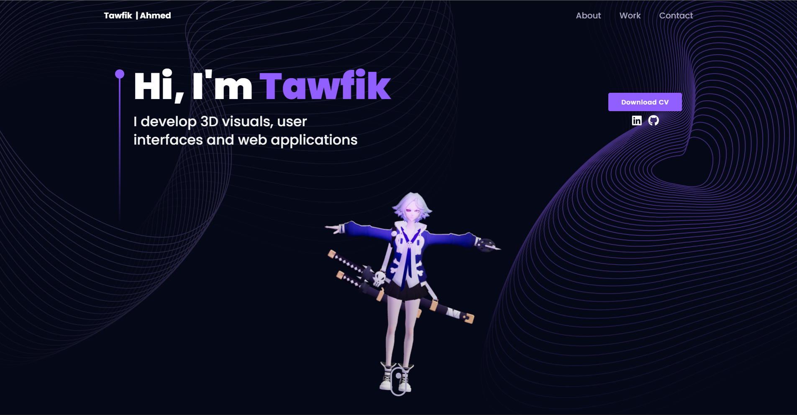

# My Portfolio 🌐

My Portfolio is an interactive 3D web experience built with React.js and Three.js. Users can explore a dynamic 3D model of my profile alongside rotating technology spheres showcasing my skills, creating a visually engaging way to present my work and expertise.

## Technologies Used

- ⚛️ **React.js**: For building a responsive and interactive UI.
- 🖼️ **Three.js**: 3D rendering library for creating dynamic models and animations.
- 🎨 **CSS & HTML**: Custom styling for smooth interactions and responsiveness.
- 🌐 **JavaScript**: Core logic for animations and interactivity.

## Key Features

- 🌟 Interactive 3D model of my profile
- 🌀 Rotating spheres displaying my technologies and skills
- 🎨 Futuristic and immersive visual design
- 📱 Fully responsive and works across devices
- ⚡ Smooth animations powered by Three.js
- 🛠️ Built with modern React.js architecture

This portfolio offers a unique, immersive, and visually stunning way to showcase my skills and projects to potential employers and collaborators.
